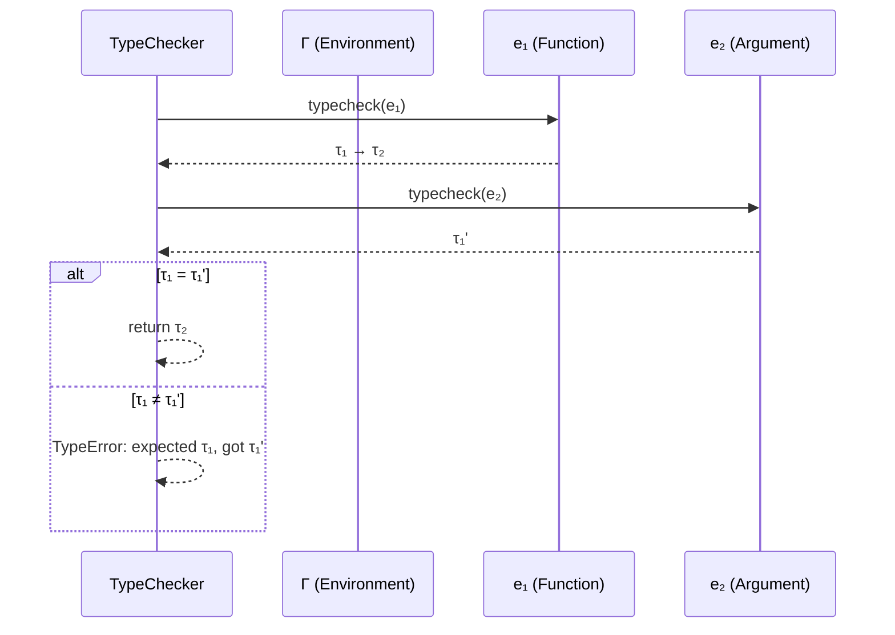

kepano's obsidian-skills teach Claude how to *edit* vault files. **Obsidian Visual Skills Pack** teaches Claude how to *draw* — generating Excalidraw diagrams, Mermaid charts, and Canvas mind maps directly in your vault from a single text prompt. Three skills, three output formats, one command: "draw me a diagram of X." The result is a file you can view, edit, and share natively in Obsidian.

*Source: [axtonliu/axton-obsidian-visual-skills on GitHub](https://github.com/axtonliu/axton-obsidian-visual-skills) | [产品经理胡笛笛 on Xiaohongshu](https://www.xiaohongshu.com/) | [Axton Liu](https://axtonliu.ai)*

## The Three Skills at a Glance

| Skill | Output | Best for | File type |
|---|---|---|---|
| **Excalidraw** | Hand-drawn aesthetic diagrams | Architecture, flowcharts, system designs | `.md` (Obsidian mode) or `.excalidraw` |
| **Mermaid** | Structured charts with syntax validation | Sequence diagrams, state machines, process flows | Mermaid code block in `.md` |
| **Canvas** | Interactive spatial layouts | Mind maps, knowledge graphs, relationship webs | `.canvas` (JSON) |

```
"Draw me a diagram of X"
        │
        ├─ Architecture / system design?  → Excalidraw
        │   (hand-drawn feel, flexible layout)
        │
        ├─ Process / sequence / state?    → Mermaid
        │   (structured, version-controllable)
        │
        └─ Relationships / exploration?   → Canvas
            (interactive, node-and-edge, zoomable)
```

## Installation

### Via Claude Code marketplace

```bash
/plugin marketplace add axtonliu/axton-obsidian-visual-skills
/plugin install obsidian-visual-skills
/reload-plugins
```

### Manual

```bash
git clone https://github.com/axtonliu/axton-obsidian-visual-skills.git
cp -r axton-obsidian-visual-skills/skills/ ~/.claude/skills/
```

**Prerequisite for Excalidraw:** Install the [Excalidraw plugin](https://github.com/zsviczian/obsidian-excalidraw-plugin) in Obsidian. Mermaid and Canvas work without extra plugins.

## Skill 1: Excalidraw — Hand-Drawn Diagrams

Excalidraw produces diagrams with a hand-drawn aesthetic — the informal, whiteboard-like style that's become popular in technical documentation and presentations.

### Supported diagram types

| Type | Use case | Example prompt |
|---|---|---|
| **Flowchart** | Process steps, decision trees | "Draw a flowchart of the CI/CD pipeline" |
| **Mind map** | Brainstorming, topic exploration | "Mind map of type system design decisions" |
| **Hierarchy** | Org charts, class inheritance | "Draw the class hierarchy for the AST nodes" |
| **Relationship** | Entity relationships, dependencies | "Diagram the module dependencies in this codebase" |
| **Comparison** | Side-by-side analysis | "Compare static vs dynamic type checking approaches" |
| **Timeline** | Project phases, historical events | "Timeline of programming language paradigms" |
| **Matrix** | 2D categorization | "2x2 matrix: safety vs expressiveness for type systems" |
| **Freeform** | Custom layouts | "Draw the data flow through the PCSAT pipeline" |

### Output modes

```
Obsidian mode (default):
  → .md file with embedded Excalidraw JSON
  → Opens directly in Obsidian with Excalidraw plugin
  → Can edit visually in-place

Standard mode:
  → .excalidraw file
  → Editable on excalidraw.com
  → Good for sharing outside Obsidian

Animated mode:
  → .excalidraw file with animation sequencing
  → Elements appear step-by-step
  → Great for presentations and teaching
```

### Activation triggers

Say any of: "Excalidraw", "diagram", "flowchart", "mind map", "画图", "流程图", "思维导图"

### Example: Research architecture diagram

```
You: Draw an Excalidraw diagram showing the PCSAT verification
     pipeline: source program → CHC encoding → PCSAT solver →
     verdict. Show the relational cost invariant as an annotation
     on the encoding step. Use the hierarchy layout.
```

Claude generates a `.md` file with embedded Excalidraw JSON. Open it in Obsidian — you see a clean hand-drawn architecture diagram that you can drag, edit, and annotate.

### Example: Teaching — step-by-step algorithm

```
You: Create an animated Excalidraw diagram showing how merge sort
     works on the array [38, 27, 43, 3, 9, 82, 10]. Show each
     split and merge step appearing sequentially.
```

The animated mode makes elements appear one by one — perfect for lecture slides where you reveal each step as you explain.

## Skill 2: Mermaid — Structured Charts

Mermaid generates diagrams as text-based syntax inside Markdown code blocks. The key advantage: **version-controllable**. You can diff, merge, and track Mermaid diagrams in Git, unlike binary image files.

### Supported diagram types

| Type | Mermaid syntax | Use case |
|---|---|---|
| **Flowchart** | `graph TD/LR` | Process flows, decision trees |
| **Sequence diagram** | `sequenceDiagram` | API calls, protocol interactions |
| **State diagram** | `stateDiagram-v2` | State machines, automata |
| **Mind map** | `mindmap` | Topic hierarchies |
| **Circular flow** | `graph` with cycles | Feedback loops, iterative processes |
| **Class diagram** | `classDiagram` | OOP design, type hierarchies |

### Built-in quality checks

The skill includes syntax validation that prevents common Mermaid errors:
- Naming conflicts between nodes and subgraphs
- Special characters breaking the parser
- Subgraph declaration order issues
- Layout orientation conflicts

### Example: Research — type system rules as sequence diagram

```
You: Create a Mermaid sequence diagram showing the type checking
     process for a function application in STLC:
     1. Check function has arrow type
     2. Check argument matches domain
     3. Return codomain type
     Show the environment lookups and the error case.
```

Output (in your Obsidian note):

~~~

~~~

This renders natively in Obsidian's reading mode — no plugins needed.

### Example: Teaching — state machine for a protocol

```
You: Mermaid state diagram for the TCP 3-way handshake.
     Show CLOSED, SYN_SENT, SYN_RECEIVED, ESTABLISHED states
     with transitions labeled by segment types.
```

Students see a clean state diagram in their notes. They can copy the Mermaid source, edit it, and submit modified versions for assignments.

## Skill 3: Canvas — Interactive Spatial Layouts

Canvas produces `.canvas` files — Obsidian's native format for spatial, node-and-edge layouts. Unlike Excalidraw (drawings) or Mermaid (structured charts), Canvas is **interactive** — you can zoom, pan, drag nodes, and click through to linked notes.

### Layout modes

| Mode | Description | Best for |
|---|---|---|
| **MindMap** | Radial hierarchy from a central node | Topic exploration, brainstorming, chapter outlines |
| **Freeform** | Flexible positioning with custom connections | Knowledge graphs, research landscapes, project boards |

### Features

- **Responsive node sizing** — larger nodes for more content
- **Automatic edge labels** — relationships described on connections
- **Color coding** — preset and custom colors for grouping
- **Overlap prevention** — nodes auto-space to avoid collision
- **Group nodes** — cluster related items visually
- **Wikilinks** — nodes can link to other vault notes via `[[note name]]`

### Example: Research — literature landscape

```
You: Create a Canvas mind map of the relational verification
     literature. Center node: "Relational Verification". Branch
     into: Type-based (RelCost, DuCostIt), Logic-based (PCSAT,
     CHC), Simulation-based (bisimulation, coupling). For each
     paper, add author and year. Color-code by approach.
```

Result: A `.canvas` file with a zoomable knowledge graph. Each paper is a node with metadata. Clicking a node can link to the clipped paper note (if you used Web Clipper to save it). The entire literature review becomes navigable.

### Example: Teaching — course module map

```
You: Create a Canvas for CS305 Module 3: Memory Safety.
     Central topic: "Memory Safety". Branches:
     - Spatial safety (buffer overflows, bounds checking)
     - Temporal safety (use-after-free, dangling pointers)
     - Rust ownership model (borrow checker, lifetimes)
     - Tools (AddressSanitizer, Valgrind, Miri)
     Link each leaf to the corresponding lecture note if it
     exists in the vault.
```

Students open the Canvas in Obsidian and navigate the module visually. Each node is a clickable entry point into the relevant lecture notes.

## Choosing the Right Skill

```
What do you need?
│
├─ Something that looks hand-drawn / informal?
│  ├─ Static? → Excalidraw (Obsidian mode)
│  └─ Animated / step-by-step? → Excalidraw (animated mode)
│
├─ Something structured / version-controllable?
│  ├─ Sequence of interactions? → Mermaid (sequence diagram)
│  ├─ State machine? → Mermaid (state diagram)
│  └─ Process flow? → Mermaid (flowchart)
│
└─ Something interactive / navigable?
   ├─ Hierarchical topic? → Canvas (MindMap mode)
   └─ Freeform relationships? → Canvas (Freeform mode)
```

| Factor | Excalidraw | Mermaid | Canvas |
|---|---|---|---|
| **Visual style** | Hand-drawn, informal | Structured, clean | Interactive nodes |
| **Editability** | Visual drag-and-drop | Edit text source | Drag nodes in Obsidian |
| **Git-friendly** | No (JSON blob) | Yes (plain text) | Partially (JSON) |
| **Needs plugin** | Yes (Excalidraw plugin) | No (built-in) | No (built-in) |
| **Best audience** | Presentations, papers | Documentation, code | Exploration, navigation |
| **Animation** | Yes (animated mode) | No | No |
| **Links to notes** | Limited | No | Yes (`[[wikilinks]]`) |

## The Full Visual Pipeline

Combined with the other Obsidian tools:

```
Web Clipper          CLI              kepano/skills      Visual Skills
(CAPTURE)     →    (READ)      →    (EDIT/CREATE)   →   (DRAW)
                                                          │
Clip papers         Search vault     Write .md            ├─ Excalidraw
from arXiv          Read notes       Edit .base           ├─ Mermaid
Save to inbox/      Feed context     Build .canvas        └─ Canvas
                                     Update props

Example flow:
1. Clip 5 papers on type safety with Web Clipper
2. CLI reads them, feeds to Claude
3. kepano/skills organizes metadata in a .base view
4. Visual Skills generates a Canvas knowledge graph
   linking all papers with relationship edges
```

## Research Scenarios

### Scenario 1: Paper submission — figure generation

```
You: I need a figure for Section 3 of our POPL paper showing
     the type system architecture. Draw an Excalidraw diagram
     with: Surface language → Elaboration → Core IR → Type checker
     → Verified program. Show the relational cost annotations
     flowing through each stage.
```

Export the Excalidraw as SVG/PNG for the paper. The hand-drawn style is acceptable in many PL venues and adds visual warmth to otherwise dense technical content.

### Scenario 2: Proof structure visualization

```
You: Create a Mermaid flowchart showing the dependency structure
     of our soundness proof. Lemma 1 (substitution) feeds into
     Lemma 3 (preservation). Lemma 2 (canonical forms) feeds into
     Lemma 4 (progress). Both feed into Theorem 1 (soundness).
     Color completed lemmas green, in-progress yellow, unstarted red.
```

Track proof progress visually. Update the Mermaid source as you complete each lemma — it's just text, so it diffs cleanly in Git.

### Scenario 3: Related work landscape

```
You: Canvas mind map of all papers cited in our Related Work
     section. Group by: type-based approaches, logic-based
     approaches, testing-based approaches. Add edges where
     Paper A extends Paper B. Link each node to the clipped
     note in my vault.
```

Navigate the related work spatially. Click a node to read the clipped paper. Identify gaps visually — areas of the canvas with few nodes.

## Teaching Scenarios

### Scenario 1: Lecture preparation — algorithm animations

```
You: Animated Excalidraw of Dijkstra's algorithm on a 6-node
     graph. Step 1: initialize distances. Step 2: visit node A.
     Step 3: relax edges. ... Show the priority queue state at
     each step. Each step appears sequentially.
```

Open the Excalidraw in presentation mode during lecture. Step through the animation as you explain each phase.

### Scenario 2: Student reference cards

```
You: Mermaid class diagram showing the AST node hierarchy for
     our teaching language: Expr (base) → IntLit, BoolLit, BinOp,
     IfExpr, LetExpr, FunExpr, AppExpr. Include the key fields
     for each node.
```

Students paste this into their own Obsidian notes. They can modify it as they extend the language in assignments.

### Scenario 3: Course module navigation

```
You: Canvas mind map for the entire CS305 syllabus. Center:
     "CS305 Computer Security". Branches for each module
     (Crypto, Web Security, Memory Safety, Access Control,
     Network Security). Each module links to its lecture notes
     folder. Color by unit exam coverage.
```

Publish this Canvas as the course "home page" in a shared vault. Students navigate the course structure visually instead of scrolling through a flat syllabus.

### Scenario 4: Exam review — concept relationships

```
You: Canvas freeform diagram showing how all CS305 concepts
     connect. Buffer overflow → leads to → code injection.
     ASLR → mitigates → code injection. Stack canaries →
     detect → buffer overflow. Make it dense — this is a
     review sheet, not a teaching tool.
```

Students use this as a study map. They can add their own nodes and edges as they study.

## How LearnAI Team Could Use This

- **Paper figures** — Generate publication-ready diagrams from text descriptions. Excalidraw for architecture figures, Mermaid for formal structures.
- **Proof tracking** — Mermaid flowcharts showing lemma dependencies with color-coded completion status. Diffs cleanly in Git.
- **Literature landscapes** — Canvas knowledge graphs of cited papers, linked to clipped notes via Web Clipper. Navigate related work spatially.
- **Lecture animations** — Excalidraw animated mode for step-by-step algorithm visualizations during class.
- **Student reference material** — Mermaid class/state diagrams students can copy, edit, and extend for assignments.
- **Course navigation** — Canvas mind maps as visual syllabi linking to lecture notes, readings, and assignments.

## Real-World Use Cases

| Scenario | Skill | Output |
|---|---|---|
| System architecture for a paper | Excalidraw | SVG/PNG figure |
| Type checker data flow | Excalidraw (animated) | Step-by-step presentation |
| Proof dependency structure | Mermaid (flowchart) | Git-trackable diagram |
| API interaction protocol | Mermaid (sequence) | Documentation |
| Literature review map | Canvas (freeform) | Navigable knowledge graph |
| Course syllabus overview | Canvas (mind map) | Visual course navigation |
| Algorithm animation for lecture | Excalidraw (animated) | In-class presentation |
| Student study map | Canvas (freeform) | Review sheet with links |

## Key Details

| | |
|---|---|
| **Repo** | [github.com/axtonliu/axton-obsidian-visual-skills](https://github.com/axtonliu/axton-obsidian-visual-skills) |
| **Author** | Axton Liu |
| **License** | MIT |
| **Status** | Experimental |
| **Compatible agents** | Claude Code |
| **Prerequisites** | Obsidian + Excalidraw plugin (for Excalidraw skill only) |
| **Output types** | `.md` (Excalidraw), `.md` (Mermaid code blocks), `.canvas` (JSON) |
